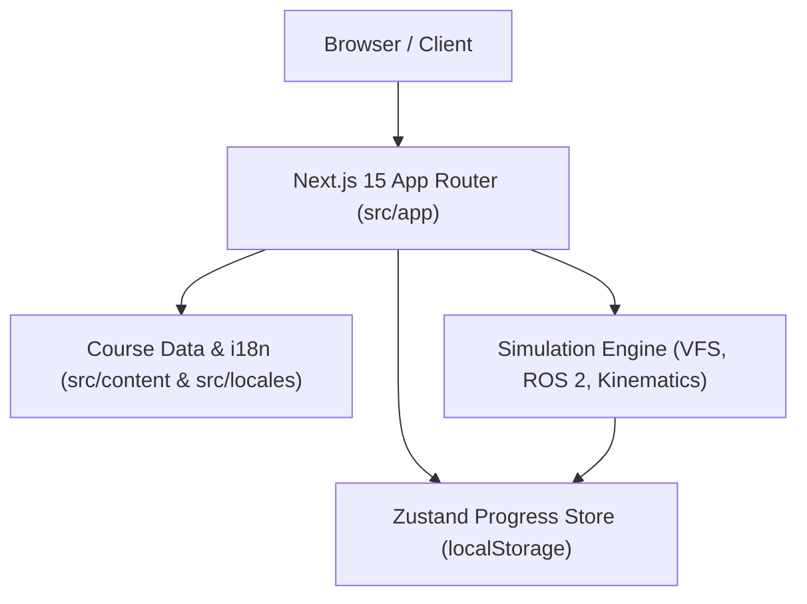

# Redbrick Robotics Academy: Architecture & Development Guide

This document provides engineers and content creators with an in-depth understanding of the internal architecture of **Redbrick Robotics Academy**.

---

## 🏗 High-Level Architecture Overview

The system is constructed with three core decoupled pillars:
1. **Next.js App Router (Routing & Layouts)**: Handles static page generation, responsive layout rendering, navigation bars, and course sidebars.
2. **Curriculum & Localization System**: Strongly-typed lesson definitions with parallel Thai (`th`) and English (`en`) trees.
3. **Simulation & Interactive Subsystems**: In-memory virtual Linux file system, ROS 2 message bus, tab completion engine, computational graph SVG renderer, and mobile robot canvas simulator.

---

## 📁 Key Directories & Roles

| Directory Path | Architecture Role |
| :--- | :--- |
| `src/app/` | Next.js App Router route segments, layouts, and page entrypoints. |
| `src/components/common/` | Shared UI components (Navbar, Footer, Markdown parser, icons, modals). |
| `src/components/course/` | Course-specific layouts: Sidebar, LessonHeader, Objectives, QuizEngine, ExerciseBox. |
| `src/components/simulator/` | Interactive tools: TerminalSimulator, ROSGraph, MobileRobotSimulator, LessonInteractiveLab, ROS2InstallationLab. |
| `src/content/` | Curriculum data structures (`linuxData.ts`, `ros2Data.ts`), including `th/` and `en/` localized content trees. |
| `src/lib/simulator/` | Pure TypeScript simulation core: `virtualFileSystem.ts`, `ros2Simulator.ts`, and `completion/completionEngine.ts`. |
| `src/lib/store/` | Zustand state store for learner progress and UI settings (`progressStore.ts`). |
| `src/locales/` | UI string dictionary for Thai (`th.json`) and English (`en.json`). |
| `src/types/` | TypeScript interfaces (`course.ts`, `terminal.ts`, etc.). |

---

## 🛣 How Routing Works

Next.js 15 App Router handles routes statically:

- **Homepage**: `/` (`src/app/page.tsx`)
- **Course Overview**:
  - Linux: `/courses/linux` (`src/app/courses/linux/page.tsx`)
  - ROS 2 Jazzy: `/courses/ros2-jazzy` (`src/app/courses/ros2-jazzy/page.tsx`)
- **Individual Lesson Pages**:
  - Dynamic Route: `/courses/[courseId]/[lessonId]` (`src/app/courses/[courseId]/[lessonId]/page.tsx`)
  - Supported Slugs: Pre-rendered using `generateStaticParams()` matching all `slug` entries in `ROS2_COURSE.modules[].lessons[]` and `LINUX_COURSE.modules[].lessons[]`.
- **Developer Playground**: `/playground/ros2` (`src/app/playground/ros2/page.tsx`)
- **Cheatsheets**: `/cheatsheet/linux` and `/cheatsheet/ros2`

---

## 📖 How Lesson Pages Work

When a user visits `/courses/ros2-jazzy/06-topics`:
1. `src/app/courses/[courseId]/[lessonId]/page.tsx` retrieves course data via `getROS2Course()` and lesson content via `getROS2Lesson("06-topics")`.
2. It wraps the page inside `LessonPageLayout` (`src/components/course/LessonPageLayout.tsx`).
3. `LessonPageLayout` renders:
   - `CourseSidebar`: Automatically expands the active module and highlights the current lesson.
   - `LessonHeader`: Module badge, lesson order, title, and reading duration.
   - `LearningObjectives`: Key bullet points.
   - `MarkdownRenderer`: Lesson concepts, syntax tables, and terminal code examples.
   - `LessonInteractiveLab`: Renders the context-aware lab tailored for the lesson (e.g. Code Editor + Terminal + Graph tab for Lesson 06).
   - `RoboticsTipBox`: Practical real-world robotics hardware context.
   - `ExerciseBox`: Interactive prompt verifying command execution against `targetCommand`.
   - `QuizEngine`: Multiple-choice assessment questions.

---

## 🎮 How Interactive Simulator Components Work

### 1. In-Browser Virtual File System (`VirtualFileSystem.ts`)
- Manages an in-memory directory tree rooted at `/home/redbrick`.
- Maintains current working directory (`cwd`), file contents, permissions, and directory creation (`mkdir -p`).
- Executes mock POSIX commands: `ls`, `pwd`, `cd`, `mkdir`, `cat`, `touch`, `rm`, `source`, `echo`.

### 2. Tab Completion Engine (`src/lib/simulator/completion/completionEngine.ts`)
- Provides bash-style autocompletion when pressing Tab in `TerminalSimulator`.
- Analyzes the token under the cursor:
  - Completes commands (`pw` → `pwd `, `mk` → `mkdir `).
  - Completes relative and absolute file paths (`cd Doc` → `cd Documents/`).
  - Supports common prefix completion (`cd D` → `cd Do` if Documents and Downloads match).

### 3. ROS 2 Computational Graph (`ROSGraph.tsx`)
- Pure React SVG rendering inspired by `rqt_graph`.
- Renders active ROS 2 nodes (rounded rectangles) and topics (ellipses) connected by animated SVG data flow lines.
- Supports presets: `minimal_publisher`, `minimal_subscriber`, `robot_controller`, and `default`.

### 4. 2D Mobile Robot Simulator (`MobileRobotSimulator.tsx`)
- HTML5 Canvas rendering of an autonomous differential-drive robot in an 8m × 5m arena.
- Kinematic engine updates linear velocity $v$ and angular yaw rate $\omega$ at 60 FPS.
- Casts 360 individual LiDAR rays detecting collisions against outer arena walls and obstacles.
- Student View vs. Advanced View: Course lessons default to Student View (hiding raw FPS, camera crosshairs, and heavy debug overlays).

---

## 🌐 How Localization (TH / EN) Works

- **State**: The user's active language is stored in Zustand (`useProgressStore.getState().locale`).
- **UI Strings**: Stored in `src/locales/th.json` and `src/locales/en.json` and loaded via `getTranslation(locale)`.
- **Lesson Content**: Dual content files exist in `src/content/th/` and `src/content/en/`. `LessonPageLayout` reactively pulls the localized version when the user clicks the TH/EN switcher in the Navbar without requiring a page reload.

---

## 💾 How Progress Tracking Works

- Controlled by `useProgressStore` (`src/lib/store/progressStore.ts`).
- Uses Zustand with `persist` middleware, writing to browser `localStorage` under key `redbrick_robotics_progress_v2`.
- Tracks:
  - `completedLessons: string[]` (array of completed lesson IDs)
  - `quizScores: Record<string, number>` (lessonId -> score)
  - `exerciseAttempts: Record<string, boolean>` (completed status)
  - `locale: "th" | "en"`
  - `fontSize: "compact" | "normal" | "large"`
